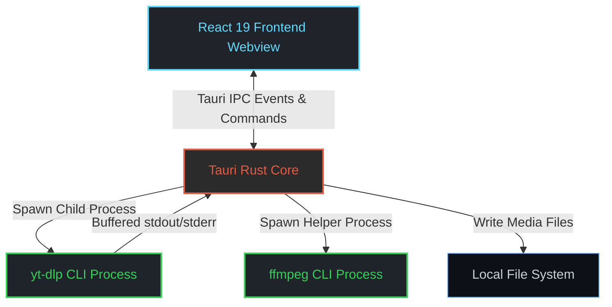

<div align="center">

# 🌌 ZenYT

**The Ultimate Lightweight YouTube Desktop Client**

[](LICENSE)
[](https://tauri.app)
[](https://react.dev)
[](https://www.rust-lang.org/)
[](#-platform-support)

ZenYT is a next-generation, high-performance desktop application that wraps the raw power of `yt-dlp` in a gorgeous, modern, and hardware-accelerated Graphical User Interface (GUI).

</div>

---

## 🌟 Introduction

Unlike heavy, memory-hungry Electron applications, ZenYT is built using **Tauri (Rust)** and **React 19**, rendering via the OS's native webview. This results in near-instant startup times, minimal CPU usage, and an installer size under 10MB. 

ZenYT is designed around **minimalism, premium aesthetics, and speed**. It employs a custom glassmorphic Dark Mode design tailored to minimize eye strain and maximize functional clarity.

---

## ✨ Key Features

- 🚀 **Real-Time Parsing & Analysis**: Fetches complete media metadata, thumbnails, uploaders, and available formats asynchronously using `yt-dlp --dump-json`.
- 📊 **Interactive Progress HUD**: Beautifully renders download progress, speed, ETA, and size by parsing `yt-dlp` output line-by-line via the Rust backend.
- 🛠️ **Self-Contained Binary Fallback**: Automatically looks for bundled `yt-dlp` and `ffmpeg` binaries inside the application resources before falling back to system PATH.
- 🎨 **Glassmorphism Design System**: Strictly hand-crafted Vanilla CSS with CSS variables, smooth animations, and interactive hover feedback. No bloated styling frameworks.
- ⚡ **Resource Efficient**: Operates on a fraction of the memory footprint of traditional desktop wrappers.

---

## 🏗️ Architecture

ZenYT utilizes Tauri's secure Inter-Process Communication (IPC) bridge:



### Electron vs. Tauri Comparison

| Feature | Electron (Typical) | Tauri (ZenYT) |
| :--- | :--- | :--- |
| **Idle Memory Usage** | ~300 MB - 500 MB | **~30 MB - 50 MB** |
| **Installer Size** | ~100 MB+ | **~5 MB - 10 MB** |
| **Backend Language** | Node.js (JavaScript) | **Rust (Memory Safe, Fast)** |
| **UI Engine** | Bundled Chromium | **Native Webview (WebView2/WebKit)** |

---

## 📂 Project Structure

```text
ZenYT/
├── src-tauri/               # Rust Backend (Tauri Host)
│   ├── Cargo.toml           # Backend dependencies
│   └── src/
│       ├── main.rs          # App entry point
│       ├── lib.rs           # Tauri builder & commands
│       └── commands.rs      # Process spawning & IPC
├── src/                     # React Frontend (Webview Client)
│   ├── hooks/               # Custom React hooks
│   ├── App.jsx              # Main UI component
│   ├── App.css              # Global styling & design system
│   └── main.jsx             # React DOM renderer
├── docs/                    # Technical Documentation
├── package.json             # Frontend dependencies
└── vite.config.js           # Vite build configuration
```

---

## 🛠️ Getting Started

### Prerequisites
1. **Node.js**: v18+ is recommended.
2. **Rust**: Cargo & Rustup compiler suite.
3. **C++ Build Tools** (Windows): Install Visual Studio Build Tools with "Desktop development with C++".

Detailed system-specific setup guides can be found in [DEVELOPMENT.md](docs/DEVELOPMENT.md).

### Installation & Execution

Clone the repository and install the dependencies:
```bash
git clone https://github.com/your-org/ZenYT.git
cd ZenYT
npm install
```

Start the Vite dev server and Tauri window concurrently:
```bash
npm run tauri dev
```

### Production Build

To build a production-ready package/installer for your native platform:
```bash
npm run tauri build
```
The output installer (e.g. `.msi`, `.dmg` or `.deb`) will be generated inside `src-tauri/target/release/bundle/`.

---

## 📚 Technical Documentation

Explore the following markdown files inside the `docs/` folder to understand more:
* 📖 [Architecture Blueprint](docs/ARCHITECTURE.md) — Learn about Tauri commands, Rust event emitting, and CLI bindings.
* ⚙️ [Development Setup](docs/DEVELOPMENT.md) — Step-by-step setup, dependencies installation, and troubleshooting.
* 📋 [Feature Specifications](docs/FEATURES.md) — Mapping of UI functionalities to `yt-dlp` commands.
* 🎨 [UI & UX Guidelines](docs/UI_UX_GUIDELINES.md) — Theme tokens, transition animations, and color system.

---

## 🤝 Contributing

We welcome contributions! Please review our [Code of Conduct](CODE_OF_CONDUCT.md) and [Contributing Guidelines](CONTRIBUTING.md) before submitting a Pull Request.

- Ensure no external CSS libraries (Tailwind, Bootstrap) are introduced. **Keep it Vanilla!**
- Run `cargo check` and verify that the app launches without errors.

---

## 📄 License

This project is licensed under the MIT License. See the [LICENSE](LICENSE) file for details.

<div align="center">
  <br />
  <p><i>Built with ☕ and Rust</i></p>
</div>